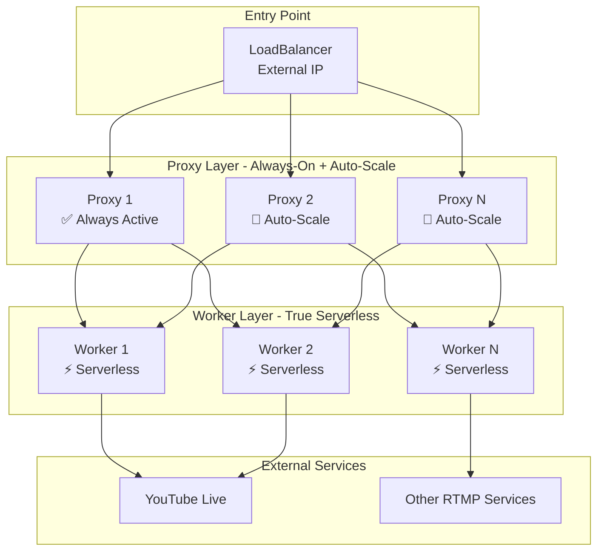

# LiveEdgeCast - Hybrid Scaling Architecture

## 🏗️ Arquitetura Overview

## 📊 Scaling Behavior

### 🔄 Proxy Layer (Always-On + Auto-Scale)
- **Min Replicas**: 1 (sempre ativo)
- **Max Replicas**: 10
- **Scaling Triggers**: 
  - Conexões ativas > 10 por proxy
  - Bandwidth > 100 MB/s por proxy  
  - CPU > 70% por proxy
- **Responsabilidades**:
  - ✅ Receber conexões RTMP
  - ✅ Load balancing entre workers
  - ✅ Buffer durante worker cold start
  - ✅ Service discovery

### ⚡ Worker Layer (True Serverless)  
- **Min Replicas**: 0 (verdadeiro serverless)
- **Max Replicas**: 100+
- **Scaling Triggers**:
  - Nova stream detectada
  - Conexão ativa no proxy
- **Responsabilidades**:
  - ✅ Processar 1 stream por worker
  - ✅ Re-stream para destinos externos
  - ✅ Isolamento completo entre streams

## 🎯 Fluxo de Conexão

1. **Client** conecta no LoadBalancer
2. **LoadBalancer** distribui para Proxy ativo
3. **Proxy** recebe stream e faz buffering
4. **KEDA** detecta nova conexão e escala worker
5. **Worker** recebe stream do proxy (cold start ~30s)
6. **Worker** re-transmite para YouTube/External
7. **Worker** escala para 0 quando stream termina
8. **Proxy** permanece ativo para próxima conexão

## 🔍 Diferenças Principais

| Aspecto | Proxy | Worker |
|---------|-------|--------|
| **Serverless** | ❌ Não (Always-On) | ✅ Sim (0 réplicas) |
| **Min Replicas** | 1 | 0 |
| **Max Replicas** | 10 | 100+ |
| **Cold Start** | N/A (sempre ativo) | ~30 segundos |
| **Função** | Load balancing | Stream processing |
| **Scaling** | Baseado em carga | Baseado em demanda |
| **Custo** | Fixo (mínimo) | Variável (on-demand) |

## 💡 Benefícios da Arquitetura Híbrida

### ✅ Proxy Always-On
- **Zero latência** para primeira conexão
- **Load balancing** imediato
- **Buffering** durante worker scaling
- **Disponibilidade** garantida

### ✅ Workers Serverless  
- **Zero custo** quando sem streams
- **Scaling infinito** para demanda
- **Isolamento** entre streams
- **Otimização de recursos**